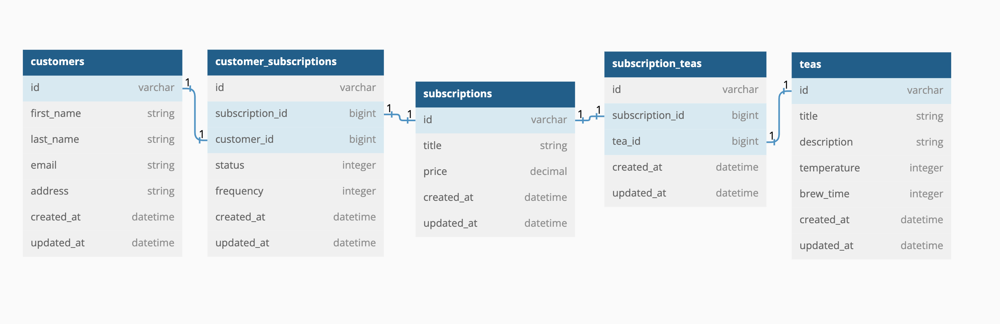

# Tea Time API

   

- Ruby 2.7.4
- Rails 5.2.8.1
- PostgreSQL 1.4.5

### Dependencies

- jsonapi-serializer
- rspec-rails

### Configuration

[Fork this repository](https://github.com/ajkrumholz/tea_time)

run `bundle install`

### Database creation

run `rails db:{create,migrate}`

### Database initialization

run `rails db:seed` if seeded data is necessary

### Database Diagram



### Run the test suite

`bundle exec rspec`

## Endpoints

### create a new subscription

`POST /api/v1/customer_subscriptions`

fields (passed in body)
customer_id - integer (required) - ID of subscribing customer
subscription_id - integer (required) - ID of subscription plan
frequency - string - available options: 'weekly', 'monthly, 'yearly' - default: 'monthly'

sample response
```
{
    "data": {
        "id": "1",
        "type": "customer_subscription",
        "attributes": {
            "customer_id": 1,
            "subscription_id": 1,
            "frequency": "monthly",
            "status": "active"
        }
    }
}
```

### cancel a subscription

`PATCH /api/v1/customer_subscriptions/{id}`

This endpoint is intended to function as a way to cancel a subscription without deleting its record, allowing customers to view both active and cancelled subscriptions.

params
id - integer (required) - ID of the customer_subscription to be cancelled

fields (passed in body)
status - string - 'cancelled'
frequency - string - available options: 'weekly', 'monthly, 'yearly' - default: 'monthly'

sample response
```
{
    "data": {
        "id": "2",
        "type": "customer_subscription",
        "attributes": {
            "customer_id": 1,
            "subscription_id": 1,
            "frequency": "monthly",
            "status": "cancelled"
        }
    }
}
```

### get subscription information for a customer

`GET /api/v1/customers/{customer_id}/subscriptions`

Returns a collection of subscriptions for a customer, including selected frequency and current status of that subscription, along with a list of ids for the teas included.

params
id - integer (required) - ID of the customer

sample response
```
{
    "data": [
        {
            "id": "1",
            "type": "subscriptions",
            "attributes": {
                "title": "Tea for Days",
                "price": "54.99",
                "frequency": "monthly",
                "status": "active"
            },
            "relationships": {
                "teas": {
                    "data": [
                        {
                            "id": "1",
                            "type": "tea"
                        },
                        {
                            "id": "2",
                            "type": "tea"
                        }
                    ]
                }
            }
        },
        {
            "id": "2",
            "type": "subscriptions",
            "attributes": {
                "title": "Teas for Now",
                "price": "10.99",
                "frequency": "monthly",
                "status": "cancelled"
            },
            "relationships": {
                "teas": {
                    "data": []
                }
            }
        }
    ]
}
```
